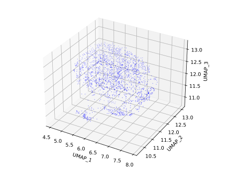
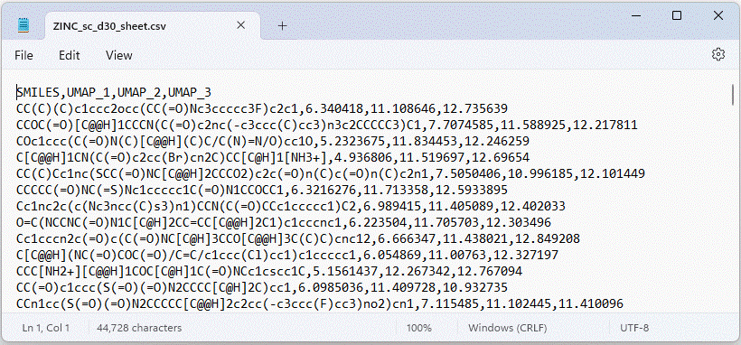
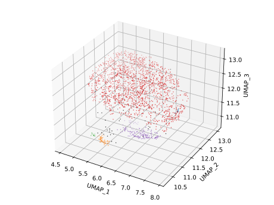
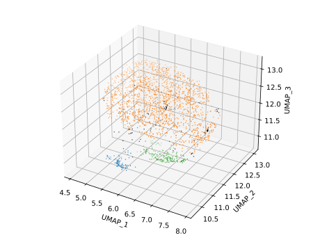
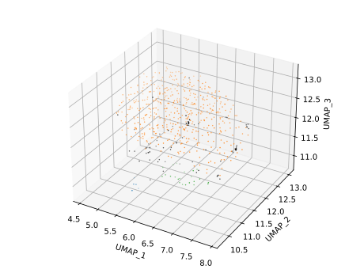
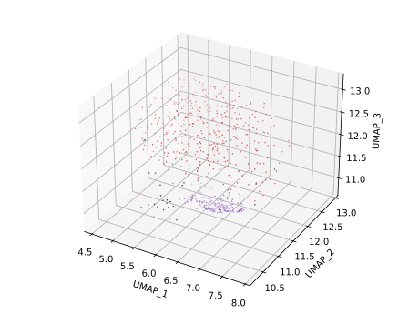

# Dedenser
A Python tool for creating and downsampling chemical pointclouds.


## Dependencies
We recommend installing the necessary packages individualy if running Dedenser from source.  Otherwise, YMLs with conda enviornments are provided in `envs`.

* alphashape
* matplotlib
* mordred
* numpy
* openpyxl
* pandas
* point-cloud-utils
* rdkit
* scikit-learn
* scipy
* umap-learn

##Installation
Dedenser can be installed from PyPI with the command:

```
pip install dedenser
```

## Using Dedenser
Dedenser is packaged and writen with the intent of being used as a comand line interface tool.  Although those who wish may utilise the code as they see fit, this tutorial should serve to assist those using the comand line interface functions.

### Generating Chemical Point Clouds

Users can generate chemical point clouds from files with the command:

```
python -m dedenser mkcloud -o <path to output> <path of input>
```

However, users may desire to use or be provided a list of SMILES.  For this we provide the comand to make a chemical pointcloud using umap-learn for embedding chemical descriptors generated by Mordred/RDKit.  

With a subset of ZINC, this can be done with the following command:

```
python -m dedenser mkcloud -o data/ZINC_short_cloud data/ZINC_short.txt
```
```
Loading Scikit-learn, RDKit, and Mordred...
Finished loading dependencies, featurizing SMILES...
Loading SMILES...
Converting to Mols...
Calculating 2D descriptors from Mols...
100%|█████████████████████████████████████████████████████████████████████████████| 2000/2000 [01:07<00:00, 29.82it/s]
Finished 2D descriptor calculations.
Loading UMAP and embedding chemical point cloud...
Done! Saved chemical point cloud at 'data/ZINC_short_cloud.npy'.
Saved 2D descriptors at 'data/ZINC_short_cloud.csv'.
```

The default column index for SMILES is 0, but can be user defined with the '-p' or '--pos' flags as such:
```
python -m dedenser mkcloud -p 3 -o <path to output> <path of input.txt>
```
For those not familiar with zero indexing, an index of 3 would indicate the 4th column in the datasheet.


If users need to use delimeters beyond the default of ',' they can specify so with the '-s' or '--sep' flag as such:
```
python -m dedenser mkcloud -p 3 -s \t -o <path to output> <path of input.tsv>
```

Additionally, if dealing with Excel sheets, the '-x' or '-excel' flags can be used (and will also save Excel sheets for other commands with outputs).
```
python -m dedenser mkcloud -x -p 3 -o <path to output> <path of input.xlsx>
```
For Excel sheets the specification of delimiters should not be needed.

Lastly, if headers are present, they can be ignored with the '-H' or '--header' flags.

### Visualizing a Chemical Point Cloud Natively

To simply visualize a chemical point cloud, the 'vis' command:
```
python -m dedenser vis data/ZINC_short_cloud.npy
```


To save the figure, the 'vis' command requires the '-f' or '--fig' and the '-o' or '--path_out' flag with pathing:
```
python -m dedenser vis -f -o data/ZINC_sc_vis data/ZINC_short_cloud.npy
```

### Downsampling with Dedenser

To downsample with Dedenser, the dedense command is used with the '-t' or '--targ' flags to specify the target percentage to be downsampled to:
```
python -m dedenser dedense -o data/ZINC_sc_d30 -t 0.3 data/ZINC_short_cloud.npy
```
```
Loading dedenser...
Dedensing...
Target of 600 molecules
Downsampled to 602 molecules
Done! Saved dedensed index at: data/ZINC_sc_d30.npy
```

Additionally, the '-a' or '--alpha' flags can be used to specify employment of alpha shapes/concave hulls instead of convex hulls when calculating the volumes of clusters, as well as the '-S' or '--strict' flags to completely drop clusters with calculated membership retentions bellow 1 (that would otherwise be brought up to 1).  The difference in outputs resulting from use of these flags/parameters is highly dependent on the initial chemical point cloud being downsampled and the downsampling target, and may not be significant.

### Visualizing Downsampled Chemical Point Clouds

When visualizing a chemical point cloud that has been downsampled, the '-d' or '--down' flags should be used to specify the pathing for the  indexes generated during downsampling. 
```
python -m dedenser vis -f -d data/ZINC_sc_d30.npy -o data/ZINC_sc_d30_vis data/ZINC_short_cloud.npy
```


### Making a Results Sheet

To make a sheet with the SMILES and chemical point cloud cordinates of the downsampled result the mksheet command is used.  The '-c' or '--cloud' flags are used to specify the file path for the origional chemical point cloud, where '-d' or '--down' is used the same as when using the mksheet command. 
```
python -m dedenser mksheet -c data/ZINC_short_cloud.npy -d data/ZINC_sc_d30.npy -o data/ZINC_sc_d30_sheet.csv data/ZINC_short.txt
```
```
Completed with no errors, wrote results to data/ZINC_sc_d30_sheet.csv
```

We can then open the sheet with our results:



Note that this is the only time where the file handle for the output file should/can be specified!

Excel sheets cannot be specified as the output type if the input is not an Excel sheet.  However, all files generated are comma delimited and can be read and rendered by Excel.

### Other Downsampling Options

The downsampling done earlier greatly reduced some dense regions in the chemical point cloud.  To visualize the HDBSCAN clusters both before and
after downsampling, the --SHOW flag can be used.

```
python -m dedenser dedense --SHOW -o data/ZINC_sc_d30 -t 0.3 data/ZINC_short_cloud.npy
```
```
Loading dedenser...
Dedensing...
```

```
Target of 600 molecules
Downsampled to 602 molecules
```

```
Done! Saved dedensed index at: data/ZINC_sc_d30.npy
```

The number of clusters is quite low, and can be increased by lowering or decreased by increasing the 'min_size' HDBSCAN parameter.
'min_size' has a default value of 5, and can be specified using the '-m' or '-min' flags.

```
python -m dedenser dedense -m 15 --SHOW -o data/ZINC_sc_d30m15 -t 0.3 data/ZINC_short_cloud.npy
```
```
Loading dedenser...
Dedensing...
```

```
Target of 600 molecules
Downsampled to 594 molecules
```

```
Done! Saved dedensed index at: data/ZINC_sc_d30.npy
```

Here we can see that by increasing the minimum number of members for a group to be considered a cluster, the number of clusters is decreased.  Further details are described in the scikit-learn documentation for [HDBSCAN](https://scikit-learn.org/stable/modules/generated/sklearn.cluster.HDBSCAN.html) with key aspects surrounding minimum cluster size [here](https://scikit-learn.org/stable/modules/clustering.html#hdbscan).

One last key feature for Dedenser is the ability to downsample based on the density of clusters.  
This is done using weight parameterized exponentials that calculate normalized density coefficients ($D_x$), where the weighting term can be increased or decreased to negative values to emphasize the prioritization of dense or sparce clusters respectively (eq. 1). 

(1)  $D_{x}=e^{w(d_i/d_t-1)}/\displaystyle\sum_{i=1}^{n}e^{w(d_i/d_t-1)}, w= weight , n= number of clusters, d_t = \sum_{i=1}^{n}d_i$

Density coefficients are multiplied by the remaining target number of molecules ($R$) to be retained to calculate the target value for each cluster ($T_x$) to be downsampled to (eq. 2)

(2) $T_x = R*D_x$

This density based weighting can recover the downsampled clusters with high density from earlier:
```
python -m dedenser dedense -dw 1 --SHOW -o data/ZINC_sc_d30w1 -t 0.3 data/ZINC_short_cloud.npy
```


The favoring of low density clusters can also be somewhat recovered by using negative weights:
```
python -m dedenser dedense -dw -200 --SHOW -o data/ZINC_sc_d30w-200 -t 0.3 data/ZINC_short_cloud.npy
```


The weighting may require some manual tuning depending on what is desired by the user.
